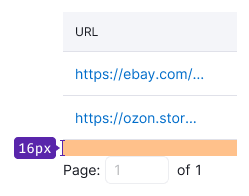

@import playground

> ⚠️ The component has a major version, changes are in the [Changelog](components/pagination/pagination-changelog).

@## Description

**Pagination** is a group of controls for navigation through the long list of paginated data.

@## Appearance

### Component consists of

- `primary` и `secondary` buttons;
- [input](/components/input/);
- [text](/style/typography/).

### Margins

Margin from the pagination to the table is always 16px.

@## When it should be used?

It is recommended to use pagination in tables, as well as when there is a long list of data which is comfortable to be looked through gradually, page by page.

@## Interaction

Size of the page where the pagination is required shall be at the discretion of the UX and UI. There are some recommendations based on the statistics:

- Minimum two user screens (± 2000 px).
- Maximum 100 lines of the table (if the lines are two-line, then 50 lines etc.).
- The table is scrolled up to the beginning upon moving to pages.
- Upon sorting and filtration pagination always returns to the first page.

| Appearance                                       | Action                                                                                                                                                  |
| ------------------------------------------------ | ------------------------------------------------------------------------------------------------------------------------------------------------------- |
|   | Moving to the first page by click                                                                                                                       |
|  | Moving to the previous page by click                                                                                                                    |
|      | Moving to the next page by click                                                                                                                        |
|             | When the input is in focus, the clickable icon `ActionReturnXS` appears inside it. By clicking it or pressing Enter the user moves to the entered page. |

> 💡 The current page, where the user is now, should be always displayed in the input.

- When the input is unfocused, we show the current page, even if the user changed this value, but did not press Enter or clicked the icon inside the input.
- If the input is empty (for example the user cleared it himself/herself) or 0 is entered, then the user will move to the first page by clicking the icon or pressing Enter.
- Such input should have limitation for entering any symbols except for numerical ones.
- The link at the end of the component shows the total number of pages. The user moves to the last page by clicking.

@## States

### The user is on the first page

The button with the icon and the button `Prev` are `disabled`.

### The user is on the last page

The button `Next` gets the state `disabled`, and the link to the last page becomes plain text.

### The user enters the value exceeding the number of the existing pages

By clicking the icon or pressing `Enter` on the keyboard the user moves to the last page. Do not show the error.

### One page of the report

We use this status only if there is some data and there may be more data.

> If there is no data or the filter is applied, then there should not be any pagination. The table should contain a message that data is absent.

### Page loading

We do not show pagination while loading, because the reply from the backend regarding the number of pages has not been received yet. It is also related to [skeletons](/components/skeleton/) and [spinners](/components/spin/).

@## Optional states

#### Select for choosing the lines in the table

Upon choosing the value in the select the page is refreshed and the value of the lines from the select is applied.

You must use the values shown on the screenshot below in the select. We do not use other values.

### It is impossible to calculate the exact number of pages

In this case we add the `tilde (≈)` to the number of pages, and they become unclickable.

@page pagination-api
@page pagination-code
@page pagination-changelog
